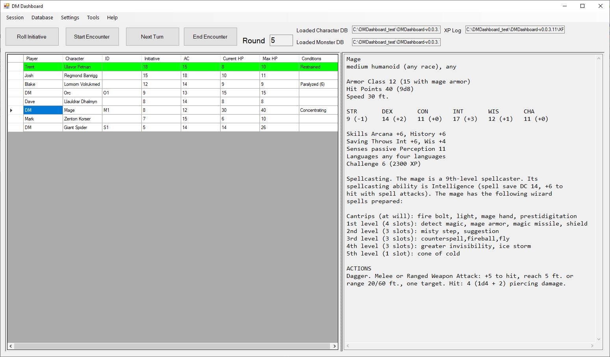
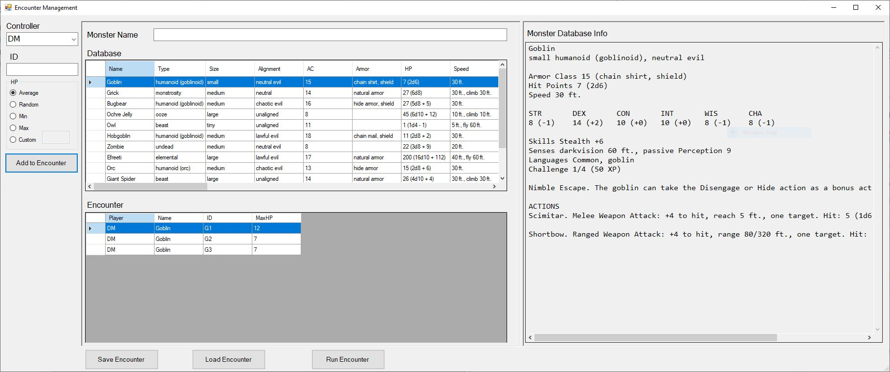
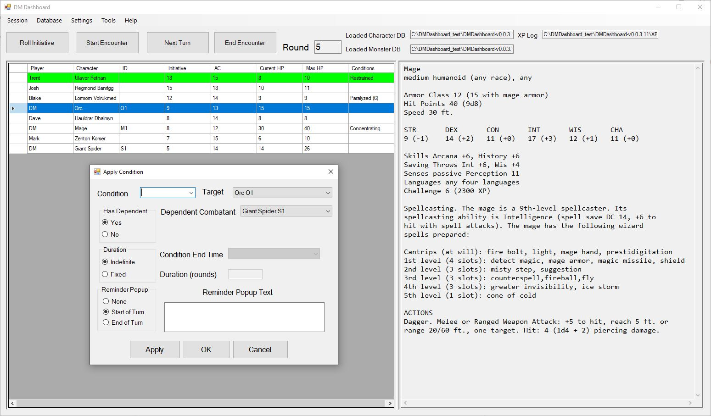

# DMDashboard Release Page

**DMDashboard** is a Windows app used to automate many of the bookkeeping tasks required of DMs when running D&D 5E. This repository serves as the official distribution point for compiled releases.

## Features
* Build/load/save/edit/run encounters
* Build/edit monster and character databases
* Save/load sessions
* Roll/sort by initiative
* Roll saving throws
* Add/track conditions, including optional reminder popups
* Track PC’s hit points, hit dice, death saving throws, AC, passive perception, and ability scores
* Track monsters' recharge actions, spell slots, and saving throw proficiencies
* Add monsters under the control of PCs (familiars, minions, hirelings, etc.)
* Add characters/monsters to an encounter in progress
* Log XP of defeated monsters
* View party status summary
* Automatic updates

## Gallery

| Main View | Encounter Builder |
| :---: | :---: |
|  |  |
| *Main view showing party stats and current encounter* | *Create and save encounters* |

| Monster Database | Condition Editor |
| :---: | :---: |
|  |  |
| *Create and store monsters* | *Create and track conditions* |

---

## Getting Started
Choose the method that works best for your setup:

### Option 1: ClickOnce Installer
**Best for:** Standard Windows installation with automatic updates.

1. **[Click here to Install DMDashboard](https://hudson4351.github.io/DMDashboard-Release/setup.exe)**
2. Follow the on-screen prompts to complete the installation.
3. Once the app launches, go to **Help > Setup > Copy Help/Sample Files**.
   * *This will copy the sample databases and the Word Tutorial to your **My Documents** folder for easy access.*

---

### Option 2: Portable Version (.zip)
**Best for:** Running the app without installation (USB drives, restricted permissions).

1. **[Download Latest ZIP Release](https://github.com/hudson4351/DMDashboard-Release/releases/latest)**
2. **Right-click** the downloaded ZIP and select **Extract All...**.
3. Open the extracted folder and run `DMDashboard.exe`.
   * *The sample databases and tutorial are located directly in the extracted folder.*
   * **Note:** Ensure the `x64` and `x86` folders remain in the same directory as the `.exe` for database support.

---

## Security Instructions (Windows SmartScreen)
Because this is an independently developed hobby project, Windows may display a blue warning screen during installation and/or at runtime that says **"Windows protected your PC."** **Don't worry!** This happens simply because the app is not signed with a $300/year "verified publisher" certificate. The app is safe to run.

**To bypass this:**
1. On the blue warning screen, click **"More info"**.
2. Click the **"Run anyway"** button that appears at the bottom.

| Step 1: Click More Info | Step 2: Click Run Anyway |
| :---: | :---: |
|  |  |

---

## System Requirements
* **Operating System:** Windows 10 or 11
* **Runtime:** [.NET Framework 4.8.1](https://dotnet.microsoft.com/en-us/download/dotnet-framework/net481)
  * *Note: Most modern Windows PCs have this. If missing, the app will prompt you, or you can use the link above.*
* **Architecture:** x64 / x86

---

## Troubleshooting

### **The app fails to start or "vanishes" on launch**
Windows often places a "Mark of the Web" lock on files downloaded from the internet. This can prevent the application or its database components from loading correctly.

1. **Right-click** the downloaded `DMDashboard.zip` file.
2. Select **Properties**.
3. Under the **General** tab (at the bottom), check the **Unblock** box.
4. Click **Apply**, then extract the files and try running the app again.

### **Missing Database / SQLite Errors**
This application uses a local SQLite database which requires specific "native" files to run. If you see an error regarding `SQLite.Interop.dll` or a "Database not found" message:

* Ensure you have extracted **all** files from the ZIP, not just the `.exe`.
* Verify that the `x86` and `x64` folders are present in the same directory as `DMDashboard.exe`.
* Ensure the `DMDashboard.exe.config` file is present in the main folder.

### **Still having trouble?**
If the app still won't launch, ensure you have the **[.NET Framework 4.8.1 Runtime](https://dotnet.microsoft.com/en-us/download/dotnet-framework/net481)** installed.

---

## Feedback & Support

Found a bug? Have an idea for a new feature?

* **Report a Bug:** Please [open a new Issue](https://github.com/hudson4351/DMDashboard-Release/issues/new) and describe the steps to reproduce the problem.
* **Feature Requests:** If there is something you'd like to see added to the dashboard, feel free to suggest it in the [Issues tab](https://github.com/hudson4351/DMDashboard-Release/issues).
* **Show Support:** If you find this tool helpful, please give this repo a ⭐—it helps me know people are using it!

**Note:** When reporting a bug, please mention your Windows version and if you saw any specific error messages (screenshots are always helpful!).

---

## License & Security
This project is licensed under the **MIT License** - see the [LICENSE](LICENSE) file for the full legal text.

* **Summary:** You are free to use, copy, and share this software.
* **Liability:** This software is provided **"as-is"** without any warranty. The author is not responsible for any data loss or issues resulting from its use.
* **Privacy:** This application does not collect or transmit any personal data. All data is stored locally on your machine.
* **Safety:** Every release is scanned via VirusTotal. You can find the latest scan report and SHA-256 checksums in the [Releases](https://github.com/YOUR_USERNAME/YOUR_REPO_NAME/releases) section.
